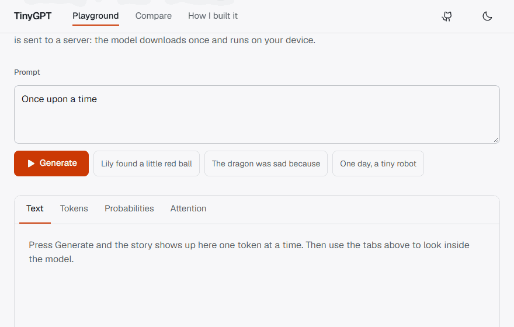

# TinyGPT

A GPT-style language model I built from scratch: my own tokenizer, my own transformer, my own training loop. I trained it on recipes, so you give it the name of a dish and it writes the ingredients and the steps. It runs entirely in your browser, so there is no server and nothing to pay for.

**Try it: https://joshuacortes195.github.io/tinygpt/**



## What it does

- **Try it.** Type the name of a dish and watch the model write the recipe one token at a time, laid out like a cookbook page. Sliders for temperature, top-k, top-p and length, plus a seed so runs are repeatable.
- **Look inside.** See how your text was split into tokens, what the model's top 10 guesses were at every step, and which earlier words each attention head was looking at.
- **Compare.** Run the same prompt through two models side by side.
- **How I built it.** Architecture, model stats and the real loss curves from training.

## How it works

```
text ──> BPE tokenizer ──> token + position embeddings
                                    │
                    ┌───────────────▼────────────────┐
                    │ LayerNorm → causal attention ─+ │
                    │ LayerNorm → MLP (GELU) ───────+ │  x N blocks
                    └───────────────┬────────────────┘
                                    ▼
                  LayerNorm → output layer (tied to embeddings)
                                    ▼
                        probabilities for the next token
```

- **Tokenizer:** byte-level BPE with a 4,096 token vocab, written in Python and ported to TypeScript. Both are tested against the same golden cases so they always produce identical ids.
- **Model:** decoder-only transformer with hand-written multi-head causal self-attention, pre-LayerNorm blocks, GELU MLPs and tied input/output embeddings. No `nn.Transformer`, no `nn.MultiheadAttention`, no Hugging Face.
- **Training:** AdamW, cosine schedule with warmup, gradient clipping, mixed precision on CUDA, and checkpoints that resume bit-for-bit.
- **Data:** recipes from [RecipeNLG](https://recipenlg.cs.put.poznan.pl/), about 329M tokens, each one a title, an ingredient list and directions. The dataset is for non-commercial research and education use, which is what this project is.
- **Browser:** the model is exported to ONNX and run with ONNX Runtime Web in a Web Worker. WebGPU when the browser has it, WebAssembly otherwise.

| Model | Parameters | Layers / heads / width | Context | Val loss | Training time |
| --- | --- | --- | --- | --- | --- |
| Recipes small | 10.5M | 5 / 6 / 384 | 256 | 1.537 | 48 min |
| Recipes | 27.4M | 8 / 8 / 512 | 256 | 1.430 | 2 h 59 min |

Both were trained on one RTX 3060. In Chrome, the 27M model writes about 75 tokens/sec on WebGPU.

**Earlier versions.** I first trained the same code on TinyStories (short children's stories) and, as a side experiment, fine-tuned SmolLM2-135M on those stories with my own LoRA code. Those models are no longer on the site, but the code, configs and results are still here and written up in [LEARNING.md](LEARNING.md).

More detail on every part, with the reasoning behind it, is in [LEARNING.md](LEARNING.md).

## Layout

```
model/            Python: tokenizer, GPT, training, ONNX export
  tinygpt/        the package
  configs/        recipes.yaml, recipes-small.yaml, plus the older story configs
  scripts/        prepare_data, train, sample, export_onnx, finetune_lora
  tests/
web/              React + TypeScript + Vite + Tailwind
  public/models/  manifest.json + one folder per model
shared/fixtures/  tokenizer test cases checked by both Python and TypeScript
LEARNING.md       notes on how each part works
TRAINING.md       step by step guide for training and publishing a model
PROGRESS.md       what is done and what is left
```

## Run it yourself

```bash
# python side
python -m venv .venv
.venv\Scripts\activate            # mac/linux: source .venv/bin/activate
pip install torch --index-url https://download.pytorch.org/whl/cu124   # nvidia gpu
pip install -e "./model[dev]"
cd model && pytest

# web side
cd web
npm install
npm test
npm run dev
```

No NVIDIA GPU? Install the CPU build instead: `pip install torch --index-url https://download.pytorch.org/whl/cpu`. The smoke config trains on a CPU in a few minutes.

On an Intel Mac, PyTorch stopped shipping wheels after 2.2, so use Python 3.11 with `pip install torch==2.2.2 "numpy<2"`.

To train the real models and publish them, follow [TRAINING.md](TRAINING.md).

## Adding a model to the site

The site never hardcodes a model. It reads `web/public/models/manifest.json`, so adding one is:

```bash
cd model
python scripts/export_onnx.py runs/recipes/ckpt.pt --id recipes --name "Recipes (27M)" --default --format recipe
cd ../web
npm run deploy
```
